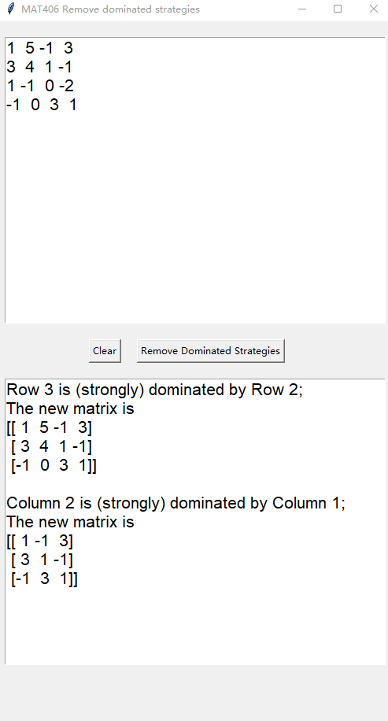

# MAT406(Mathematical Introduction to Game Theory)-Program
A computer program that takes as an input a matrix (of a  zero-sum game) of arbitrary size and gives as an output the reduction of this matrix once all domination by pure column and rows have been taken care of.

## GETTING STARTED
You can either choose to run the python file "Program.py" (if you have python installed, NumPy and Tkinter libraries are required) or the "Program.exe" file in the dist folder.

## How to use the program
The program is pretty simple to use. There will be two text boxes. The upper one is for you to enter the matrix, the lower one is for outputs (reduction process)

 

 

Enter the matrix in the upper text box
Separate the numbers by 1 space
Each row needs to be put into a new line
Click the button "Remove Dominated Strategies"
The solution with the process will appear in the lower text box.

And example will be:
 

 
